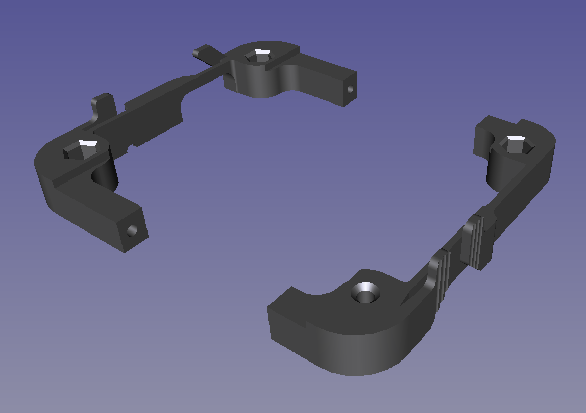

*Frame for card10 badge*

This frame, intended to be 3D printed, is for use with card10 badge and 20mm watchbands. The Watchband interfaces with a pin of ~3,2mm in diameter.

This print is somewhat demanding, so good bed levelling, proper adhesion and a small layer height are advisable. 

Also, this will not work without good cooling as it includes overhangs of 45° and worse. I printed it on a prusa i3MK3s with a .25mm nozzle at .1mm layer height and got good results.

Note that there are 4 downfiring LEDs in the corners of Harmonic Board which will be covered up by this Frame. Printing with transparent or translucent filaments will turn this downside into a nice effect

